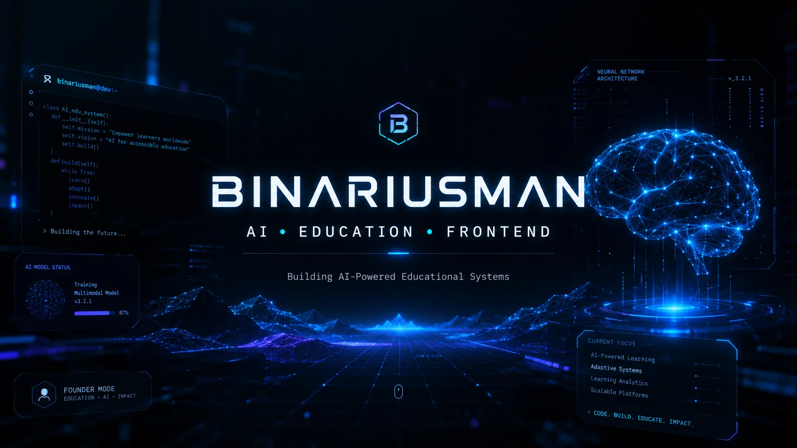

<div align="center">



<br>
<br>

# ⚡ BINARIUSMAN

### AI • FRONTEND • EDUCATION SYSTEMS

<p>
Building modern educational experiences powered by AI.
</p>

<br>


</div>

---

## 🧠 Sobre Mí

```yaml
nombre: Rafael
alias: Binariusman
rol: Constructor de Sistemas AI & Arquitecto Frontend
ubicacion: Puebla, México

mision:
  Crear sistemas educativos potenciados por inteligencia artificial.

enfoque:
  - Ecosistema Astro
  - Workflows con IA
  - Sistemas UI Modernos
  - Automatización
  - Tecnología Educativa

construyendo_actualmente:
  - Plataforma ENSA Web
  - Sistemas educativos mejorados con IA
  - Interfaces responsivas modernas
  - Workflows de automatización

filosofia:
  - Aprender profundamente
  - Construir constantemente
  - Diseñar para humanos
  - Utilizar IA como multiplicador
  